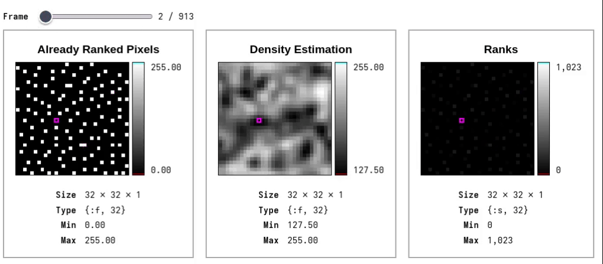
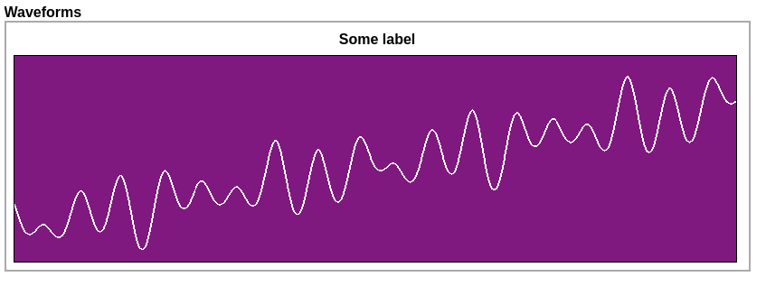

# KinoPhonograph



KinoPhonograph is a helper module for rendering 1D and 2D `Nx.Tensor` audio signals as wave forms in [Livebook](https://livebook.dev/).

## Installation

[](https://hex.pm/packages/kino_phonograph)

In Livebook add `kino_phonograph` to your dependencies:

```elixir
Mix.install([
  {:nx, "~> 0.10.0"},
  {:kino, "~> 0.20.0"},
  {:image, "~> 0.62.1"},
  # add this:
  {:kino_phonograph, "~> 0.1.0"}
])
```

## Example

[](https://livebook.dev/run?url=https%3A%2F%2Fgithub.com%2Flaszlokorte%2Fkino_phonograph%2Fblob%2Fmain%2Fguides%2Fexample.livemd)

```elixir
Nx.iota({1, 8000})
|> Nx.subtract(4000)
|> Nx.divide(300)
|> Nx.add(Nx.iota({1, 8000}) |> Nx.divide(80) |> Nx.add(1) |> Nx.sin() |> Nx.multiply(3))
|> Nx.add(Nx.iota({1, 8000}) |> Nx.divide(141) |> Nx.add(2) |> Nx.sin() |> Nx.multiply(2))
|> Nx.add(Nx.iota({1, 8000}) |> Nx.divide(62) |> Nx.add(3) |> Nx.sin() |> Nx.multiply(4))
|> KinoPhonograph.WavePlot.plot(
  title: "Sum of Sines",
  labels: ["Some label"],
  width: 800,
  height: 100,
  background: {0.5, 0.1, 0.5, 1.0},
  foreground: {1, 1, 1, 1}
)
```


